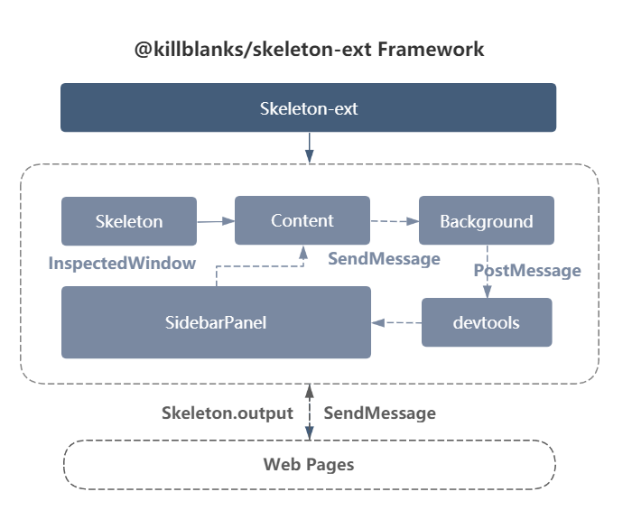

## 背景

> 预渲染提供的功能仅仅只能解决白屏问题，但是这个内容实际上仅仅是 css 和 html 生成的框架，存在页面的结构和实际不符合，空白过多等问题

## 原理

基于[一种自动化生成骨架屏的方案](https://github.com/Jocs/jocs.github.io/issues/22)，我魔改了[skeleton](https://github.com/ElemeFE/page-skeleton-webpack-plugin/tree/master/src/script)代码，当谷歌插件加载后，注入页面中，选中当前元素，运行`outputSkeleton`，即可拿到骨架屏的 html&css

## 框架



## 快速开始

### 1. 安装

目前推荐两种方式安装

### 1.1 谷歌商店(暂未上架)

### 1.2 本地安装

- `git clone`[killblanks](https://github.com/warpcgd/killblanks)源码

```sh
  git clone https://github.com/warpcgd/killblanks.git
```

- 打开`chrome:extensions`，勾选`开发者模式`，点击`加载已解压的拓展程序`,选择clone源码中`killblanks/packages/skeleton-chrome-ext/dist`文件夹

- 视频教程


### 2. 使用

- 打开`dev-tools`
- 切换到`Element`tab
- 点击`选择元素`按钮，选择任意元素
- 在`sidebar`中找到`SKELETON`
- 点击render即可

- 视频教程


